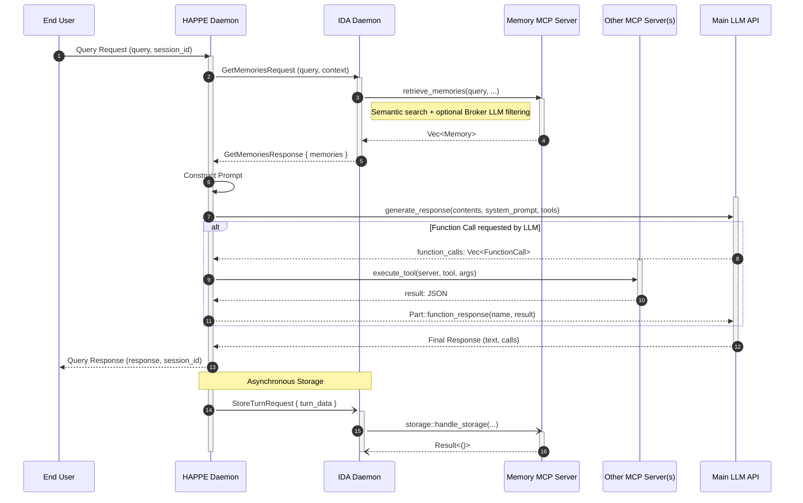

# End-to-End Query Flow

This document outlines the full lifecycle of a user query as it travels from the End&nbsp;User through the HAPPE daemon, internal communication with the IDA daemon, interactions with MCP servers, calls to the main LLM API, and back to the End User. It also covers the asynchronous memory storage process.

---

## Overview of Components

- **End User**: The person or client application issuing a natural language query.
- **HAPPE (Host Application Environment)**: Orchestrates user interactions, LLM calls, and MCP tool execution; communicates with IDA via IPC.
- **IDA (Internal Dialogue App)**: Manages persistent memory: retrieves context and stores completed turns; communicates over IPC with HAPPE.
- **Memory MCP Server**: Provides memory retrieval and storage via MCP protocol.
- **Other MCP Servers**: Hosts additional MCP tools invoked during LLM generation.
- **Main LLM API**: The external LLM endpoint that generates natural language responses.

---

## Sequence Diagram

---

## Detailed Step-by-Step Flow

1. **End User -> HAPPE**
   - The end user or client application sends a raw text query to the HAPPE daemon over the chosen transport (e.g., HTTP, WebSocket, CLI).
   - This is represented internally as `HappeQueryRequest { query, session_id }`.

2. **HAPPE -> IDA (IPC)**
   - HAPPE immediately forwards the raw query to the IDA daemon via IPC using `InternalMessage::GetMemoriesRequest { query, conversation_context }`.
   - The IPC transport is configured in HAPPE's settings (Unix socket path).

3. **IDA -> Memory MCP Server (MCP)**
   - Upon receiving the query, IDA invokes the memory MCP server with `retrieve_memories(query, max_results, broker_llm)`.
   - The memory store performs semantic search and optionally filters results using a broker LLM.

4. **Memory MCP -> IDA**
   - The memory service returns a list of relevant `Memory` objects (e.g., past messages, facts).
   - IDA converts these to `MemoryItem` objects and prepares an `InternalMessage::GetMemoriesResponse` to send back.

5. **IDA -> HAPPE (IPC Response)**
   - IDA sends the retrieved memories back to HAPPE over the same IPC channel.

6. **HAPPE Prompt Construction**
   - HAPPE builds prompt parts that include memories and the user query.
   - It prepares the prompt with a system message that includes MCP capabilities.
   - Example: `"Relevant previous interactions: <memory_1>\n<memory_2>\n<original query>"`.

7. **HAPPE -> Main LLM API Call**
   - HAPPE calls `generate_response` with the constructed contents, system prompt, and available tools.
   - Common parameters include conversation history, current query content, and tool declarations.

8. **Tool Invocation (Optional)**
   - If the LLM returns function calls, HAPPE processes each call:
     - Extracts server name and tool name from the function call name
     - Calls `mcp_client.execute_tool(server_name, tool_name, arguments)`
     - Adds the tool result as a `Part::function_response` to the conversation
     - Makes another LLM request with the updated history including the tool results

9. **LLM -> HAPPE Response**
   - The LLM returns the final `(response_text, function_calls)` tuple once all tool calls (if any) are resolved.

10. **HAPPE -> End User**
    - HAPPE returns `HappeQueryResponse { response, session_id }` to the user over the original transport.

11. **Asynchronous Memory Storage**
    - HAPPE sends an async `InternalMessage::StoreTurnRequest { turn_data }` to IDA containing:
      - `user_query`: The original query string
      - `retrieved_memories`: The memories used in the prompt
      - `llm_response`: The final text response
      - `turn_parts`: The full conversation turn parts
    - IDA spawns a background task via `storage::handle_storage` to process and store the turn.

---

*End of document.*